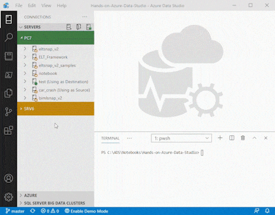

# Simple Data Flow (inspired by eltSnap)

## Easily copy a table from one SQL Server to Another

> Prerequisite: Requires **PowerShell Core** (Version 7+)

Step by Step:

1. Be sure _Destination_ server has an Open connection
2. Press **F1** to Open the Command Palette
3. Enter: **eltSnap: Simple Data Flow**
4. Select your Source & Destination connections
5. Enter a Source _Select_ Query
6. Select your Destination 'Schema' & 'Table'
7. Select 'Y' or 'N' to first _Truncate_ your Destination Table
8. Click button: **Place Command in Terminal Window**
9. Hit **Enter** to run the PowerShell command from the Terminal

## Support

Contact us at: info@bitracks.com

## Website

[BI Tracks](https://www.bitracks.com/) **10x** Acceleration for ELT/ETL: www.bitracks.com

## License

Copyright (c) BI Tracks Consulting, LLC All rights reserved.

MIT License

Permission is hereby granted, free of charge, to any person obtaining a copy of this software
and associated documentation files (the Software),
to deal in the Software without restriction, including without
limitation the rights to use, copy, modify, merge, publish, distribute, sublicense,
and/or sell copies of the Software, and to permit persons to whom the Software
is furnished to do so, subject to the following conditions:

The above copyright notice and this permission notice shall be included
in all copies or substantial portions of the Software.

THE SOFTWARE IS PROVIDED _AS IS_, WITHOUT WARRANTY OF ANY KIND, EXPRESS OR IMPLIED,
INCLUDING BUT NOT LIMITED TO THE WARRANTIES OF MERCHANTABILITY,
FITNESS FOR A PARTICULAR PURPOSE AND NONINFRINGEMENT.
IN NO EVENT SHALL THE AUTHORS OR COPYRIGHT HOLDERS BE LIABLE FOR ANY CLAIM,
DAMAGES OR OTHER LIABILITY, WHETHER IN AN ACTION OF CONTRACT, TORT OR OTHERWISE,
ARISING FROM, OUT OF OR IN CONNECTION WITH THE SOFTWARE OR THE USE OR OTHER DEALINGS IN THE SOFTWARE.
